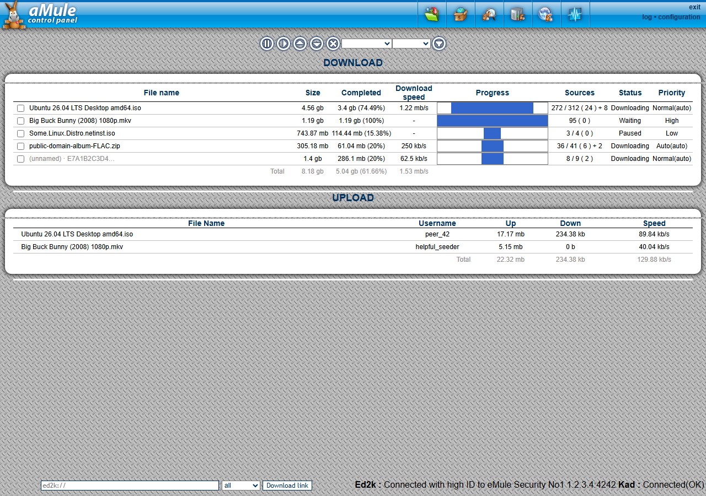

# Template: amule-default

**Origin:** migrated from the stock
[`default` template](https://github.com/amule-project/amule/tree/master/src/webserver/default)
of the [aMule project](https://www.amule.org) (GPL), images included.

A faithful reproduction of aMule's **stock web template** ("default") — same
colors, typography, framed tables, icon navigation with rollovers, login
page and number formats — rebuilt as a single-page app on the shared JSON
layer ([`common/api.php`](../../common/api.php)) instead of server-side
rendering.

There is also a [mobile screenshot](../../docs/screenshots/amule-default/mobile.png).

Differences from the original (all behavior-preserving):

* No full-page reloads or iframes: the pages poll the API and update in
  place (footer connection status included).
* Sorting, filtering and totals are computed client-side; the visible
  layout, captions and texts stay the same.
* Chunk progress bars and statistics/Kad graphs are the same server-rendered
  PNGs the stock template uses (`dyn_<hash>.png`, `amule_stats_*.png`).
* Light mobile support: the desktop appearance is untouched, but on narrow
  screens tables scroll horizontally and the footer stacks.
* Views are deep-linkable: `#download`, `#shared`, `#search`, `#servers`,
  `#kad`, `#stats`, `#prefs`, `#log`.

All images are the original GPL assets from the
[aMule project](https://github.com/amule-project/amule).
