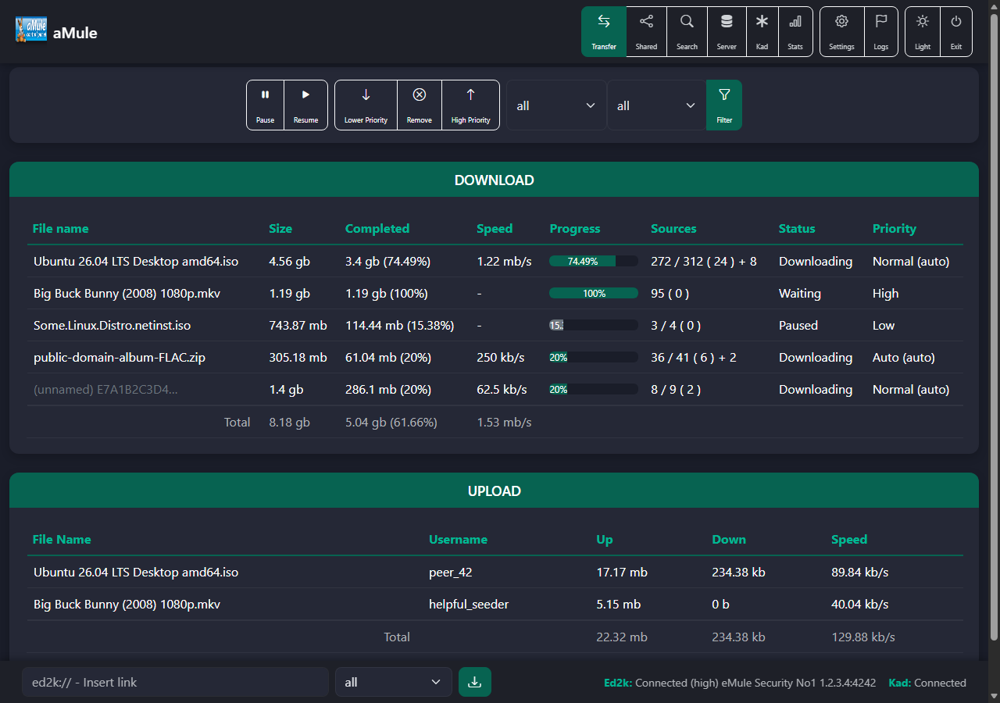

# Template: amulefresh

**Origin:** migrated from
[dcapape/amulefresh](https://github.com/dcapape/amulefresh) (GPL-3.0) by
David Capapé — "aMule Dark and Dynamic Template", a Bootstrap 5.3.2 dark
re-skin of the aMule web interface. This directory ports that design to
the shared [`api.php`](../../common/api.php) JSON layer as a Preact SPA
like the rest of the repository. Licensed **GPL-3.0-or-later**.

The original's modern dark look, faithfully transcribed: the steel-blue
brand navbar with icon-over-label buttons, the green accent
(`#076351` / hover `#00b894`), rounded cards with green headers, the
command toolbar (pause / resume / priority / remove + status & category
filters), striped hover tables with a green left-border on selected rows,
Bootstrap progress bars, the statistics tree beside a graph carousel, and
the bottom ed2k-link bar with live Ed2k / Kad status.

### Light variant

The upstream is **dark only**; a **light theme** is added on top. A
toggle in the navbar (sun / moon) switches between them — dark by default,
to match the original — and the choice is remembered (`localStorage`,
shared with `login.php`; `?theme=light|dark` also works for deep links).

## Notes on the migration

* **No CDN at runtime.** The upstream loaded Bootstrap 5.3.2, Bootstrap
  Icons 1.11.1 and Animate.css 4.1.1 from CDNs; here they are fetched
  (pinned to those versions) by `dev/download-deps.*` and self-hosted,
  with the Bootstrap-Icons font path flattened. jQuery and
  `bootstrap.bundle.js` are dropped — the navbar collapse, the graph
  carousel, tooltips and popovers are app-driven.
* The upstream already updated tables dynamically via its own
  `dload_api.php` / `search_api.php`; this port instead funnels every
  call through the shared single-flight queue (amuleweb is
  single-threaded) and refreshes the active view on an interval.
* The custom "brax" branding images are replaced by the aMule project
  logo.

## Features

Full functional parity with the `amule-default` template, in the
aMuleFresh layout:

* Transfer: downloads + uploads, command toolbar, status/category
  filters, sortable columns, totals row, per-file progress bars.
* Shared files: reload, priority up/down/set.
* Search (local / global / Kad) with availability & size filters; queue
  results into any category.
* Servers: connect / remove / add, global disconnect.
* Kad: connect from known nodes / disconnect, bootstrap from IP:port,
  nodes.dat URL update, nodes graph.
* Statistics: the collapsible tree plus aMule's server-rendered graphs in
  a carousel.
* Preferences (connection / files / webserver), aMule log & server info
  with reset, guest-mode awareness, PWA manifest, light/dark toggle.

More screenshots: [light](../../docs/screenshots/amulefresh/light.png),
[mobile](../../docs/screenshots/amulefresh/mobile.png).
