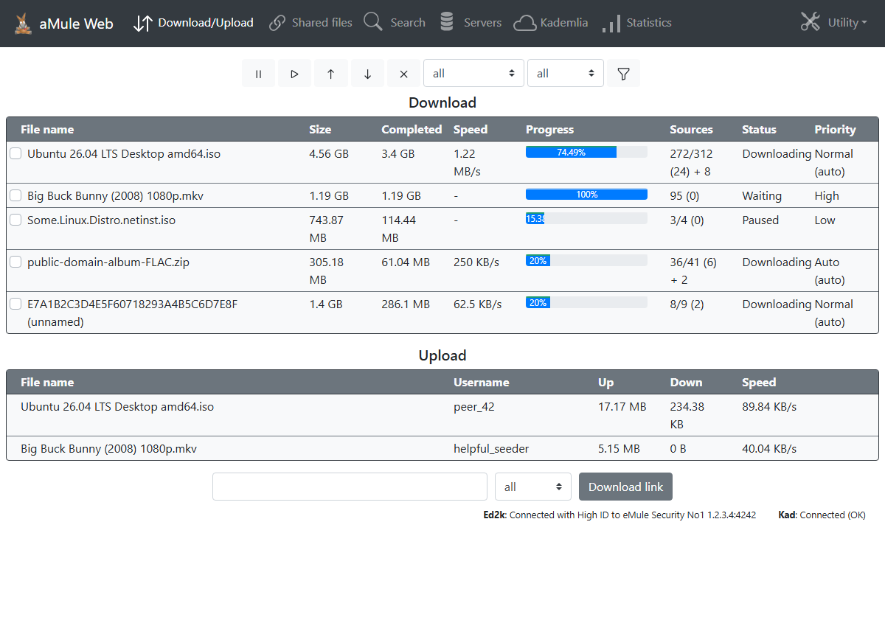

# Template: bootstrap

**Origin:** migrated from
[pedro77/amuleweb-bootstrap-template](https://github.com/pedro77/amuleweb-bootstrap-template)
(GPL-2.0) by Jaures P. — "aMuleWeb Bootstrap template", built on
**Bootstrap v4.5.0**. The upstream template reuses the page logic of
aMule's stock template (GPL-2.0-or-later), so the files in this directory
are licensed **GPL-2.0-or-later** (compatible with this repository's
GPL-3.0-or-later).

The aMule web interface restyled with Bootstrap 4: a dark **fixed-top
navbar** with the upstream's SVG icon set and a *Utility* dropdown
(Log / Configuration / Exit), responsive `div.row` lists instead of
tables, stacked **CSS progress bars** (completion + a thin green
"transferring" bar — no server-rendered chunk PNGs in this design), and a
Bootstrap *sign-in* login page with the eMule mascot.

Differences from upstream, by design:

* It is a single-page app over the shared [`api.php`](../../common/api.php)
  JSON layer — same pages, texts and number formats, no full-page reloads.
* **jQuery and `bootstrap.bundle.js` are gone** (~170 KB): the navbar
  collapse, the dropdown and the statistics tree are driven by the app
  itself. Only Bootstrap's *CSS* is shipped, fetched (pinned to the
  upstream's v4.5.0) by `dev/download-deps.*` like every other dependency
  in this repository — nothing is loaded from a CDN at runtime.
* The upstream `login.php` inlines the whole 160 KB Bootstrap stylesheet
  (amuleweb only serves images before authentication); this one inlines
  just the few rules the sign-in form uses, rendering identically.

## Features

* Downloads + uploads: pause / resume / priority / cancel toolbar with the
  upstream SVG icons, status & category filters, sortable headers, double
  progress bar, ed2k link box with category in the footer.
* Shared files: reload, priority up/down/set, transfer statistics.
* Search (local / global / Kad) with availability & size filters; queue
  results into any category.
* ed2k servers: connect / remove per row (the upstream page is a plain
  list, faithfully preserved).
* Kademlia: nodes graph plus the bootstrap-from-node form (as upstream).
* Statistics: aMule's server-rendered graphs plus the collapsible tree
  with the upstream's folder/item icons.
* Preferences in the upstream's two-column Bootstrap layout, aMule log &
  server info with reset, guest mode awareness (controls disabled),
  serialized request queue (amuleweb is single-threaded), PWA manifest
  with the upstream's full icon set.

More screenshots: [search](../../docs/screenshots/bootstrap/search.png),
[mobile](../../docs/screenshots/bootstrap/mobile.png).
