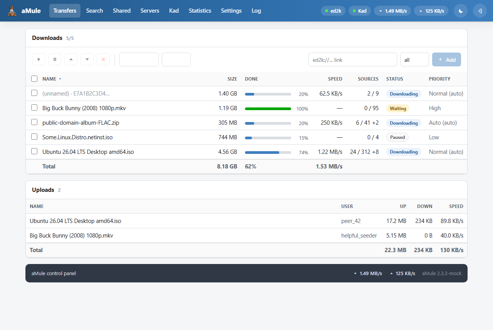

# Template: dotorg

**Origin:** original design; the visual identity follows the
[aMule project website](https://amule-org.github.io/) that premiered with
aMule 3.0 (hence the name: the *amule.org* look). The logo and favicon are
the site's own GPL assets.

A 2026 control panel built for **both desktop and phones**: the aMule
steel-blue brand scale (`#3d7ebe`) over Infima-style flat surfaces, a brand
gradient navbar with inline navigation and **live status chips** (ed2k,
Kad, speeds) on desktop, and a native-app feel on mobile with a **bottom
tab bar** plus a "More" sheet. Light and dark themes with a manual toggle
(system preference by default), PWA manifest included.

## Features

Full functional parity with the `amule-default` template, reorganized:

* Transfers: chunk-level progress (`dyn_<hash>.png` + CSS fallback),
  pause / resume / priority / cancel, status & category filters, totals,
  inline ed2k link box with category.
* Search (local / global / Kad) with availability & size filters; queue
  results into any category.
* Shared files: reload, priority up/down/set, transfer statistics.
* Servers: connect / remove / add, global disconnect, connected badge.
* Kad: connect from known peers / disconnect, bootstrap from IP:port,
  nodes.dat URL update, nodes graph.
* Statistics: aMule's server-rendered graphs plus the collapsible tree.
* Settings: the complete aMule preferences form.
* Log & server info with reset.
* Guest mode awareness, serialized request queue (amuleweb is
  single-threaded), deep-linkable views (`#transfers`, `#search`, …).

More screenshots: [mobile](../../docs/screenshots/dotorg/mobile.png),
[dark](../../docs/screenshots/dotorg/dark.png).
