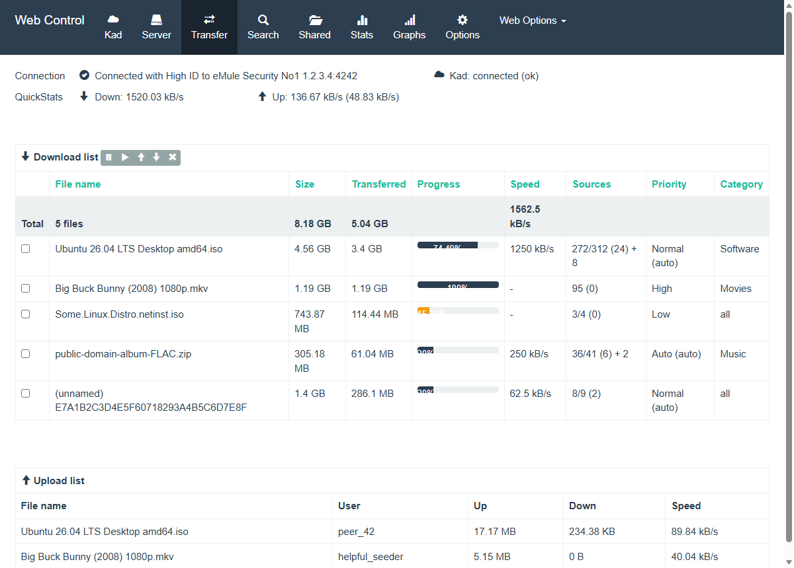

# Template: emodernui

**Origin:** migrated from
[vincenzo-petronio/eMuleModernUI](https://github.com/vincenzo-petronio/eMuleModernUI)
(GPL-2.0) — "Responsive template for **eMule** Web interface based on HTML5
Boilerplate & Bootstrap". The upstream is a design for eMule's web server
(`.tmpl` placeholders + HTML prototypes) built on the **Bootswatch
"Flatly" 3.1.1** theme; this directory ports that design to **aMule** on
the shared [`api.php`](../../common/api.php) JSON layer. Licensed
**GPL-2.0-or-later**.

Flat Bootstrap 3 look: the Flatly dark navbar with icon-over-label
entries (Kad / Server / Transfer / Search / Shared / Stats / Graphs /
Options) and a *Web Options* dropdown (eD2k link modal, Log, ServerInfo,
Logout), connection + QuickStats rows under the navbar, `panel`-based
forms and bordered hover tables, per-row popover menus.

## eMule → aMule mapping

The upstream prototypes reference eMule-only assets and features; this
port substitutes or documents them:

* The eMule gif icon set (`h_*.gif`, `arrow_*.gif`, …) is **not part of
  the upstream repository** (it belongs to eMule's stock template), so
  Bootstrap's **Glyphicons** are used everywhere instead. Same for the
  login page's eMule `logo.jpg` — replaced by the aMule logo.
* `bootstrap-theme.min.css` (stock Bootstrap gradients) is loaded by the
  upstream pages but washes out Flatly's flat design (upstream covered
  the navbar with a background gif that is also missing); this port
  sticks to the pure Flatly stylesheet.
* The Bootswatch CSS and Glyphicons fonts are fetched by
  `dev/download-deps.*` **from the upstream repository itself** (exact
  files it shipped), with the font path flattened and the Google-Fonts
  `@import` removed — no CDN is contacted at runtime (Lato falls back to
  the Helvetica/Arial stack). jQuery and `bootstrap.js` are not needed:
  the navbar, dropdown, tabs, modal and popovers are app-driven.
* eMule-only features without an aMule/api.php equivalent are omitted:
  file-type/extension search filters, the *unicode* search checkbox,
  `server.met`-from-URL update, global ed2k *Connect* (only per-server
  connect and global *Disconnect* exist), server ping/failed/limit/
  version columns, clear-completed, MyInfo and DebugLog pages.

## Features

* Transfer: download list with toolbar (pause / resume / priority /
  cancel), sortable columns, totals row in the header like the upstream,
  per-file progress bars, category column; upload list.
* Server: *Server options* / *Add server* tabs, per-row popover menu
  (connect / remove), global disconnect.
* Search (Kad / global / connected server) with size & availability
  filters; results with hash column, checkbox queueing.
* Shared files with per-row priority popover and reload.
* Kad: status panel with connect (known nodes) / disconnect, bootstrap
  from IP:port, nodes graph.
* Stats: collapsible statistics tree. Graphs: aMule's server-rendered
  download / upload / connections graphs (separate view, as in the
  upstream navbar).
* Options: the upstream's two panels (Web Control: gzip + refresh;
  aMule: line capacities, speed limits, source/connection limits).
* Log and ServerInfo with reset, eD2k-link modal with category,
  guest-mode awareness, serialized request queue (amuleweb is
  single-threaded), PWA manifest.

More screenshots: [server](../../docs/screenshots/emodernui/server.png),
[mobile](../../docs/screenshots/emodernui/mobile.png).
