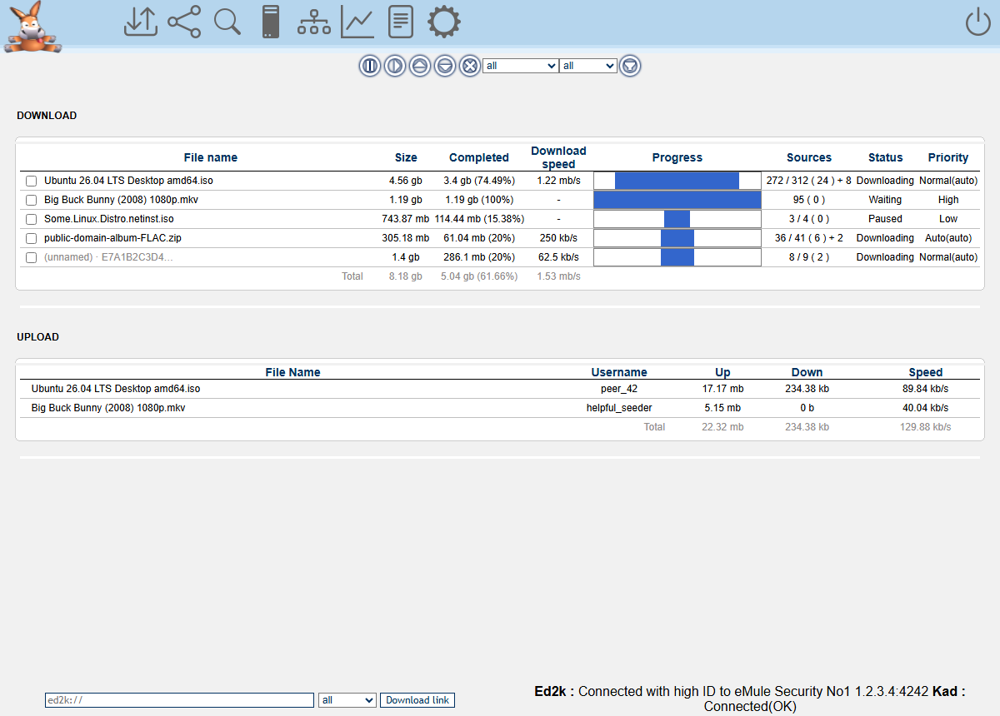

# Template: flattened

**Origin:** migrated from
[marcellozaniboni/amuleweb-flattened-template](https://github.com/marcellozaniboni/amuleweb-flattened-template)
(GPL-2.0), Marcello Zaniboni's "graphic restyle of the default web interface
for aMule": the classic layout with **flat, lighter graphics**. Because the
upstream template reuses code and images from aMule 2.3.3's stock template
(GPL-2.0-or-later), the files in this directory are licensed
**GPL-2.0-or-later** (compatible with this repository's GPL-3.0-or-later).

The classic aMule web interface, flattened: same framed layout as the stock
template but with flat frame/icon artwork, an **icon-only header** (the
"exit / log / configuration" text links became rollover icons with
tooltips), bold left-aligned section titles, a reorganized search form with
a *Refresh results* button, and a minimalist text-only login page.

Like every template in this repository it is a single-page app on top of
the shared [`api.php`](../../common/api.php) JSON layer — same pages, same
texts, same number formats as the original, but no full-page reloads — with
light phone support added (the desktop look is untouched).

## Features

* Downloads + uploads with the classic toolbar (pause / resume / priority /
  cancel), status & category filters, sortable columns, totals row, and
  amuleweb's own chunk-progress bars (`dyn_<hash>.png`).
* Shared files: reload, priority up/down/set, transfer statistics.
* Search (local / global / Kad) in the upstream's reorganized three-row
  form, with availability & size filters and a *Refresh results* button;
  queue results into any category.
* ed2k servers: connect / remove, global disconnect; ed2k link box with
  category in the footer bar.
* Kademlia: nodes graph plus the bootstrap-from-node form (the upstream
  template removed the stock Network buttons and nodes.dat URL update;
  faithfully preserved here).
* Statistics: aMule's server-rendered graphs plus the collapsible tree.
* Preferences form, aMule log and server info (with reset), guest mode
  awareness, serialized request queue (amuleweb is single-threaded).

More screenshots: [search](../../docs/screenshots/flattened/search.png),
[mobile](../../docs/screenshots/flattened/mobile.png).
