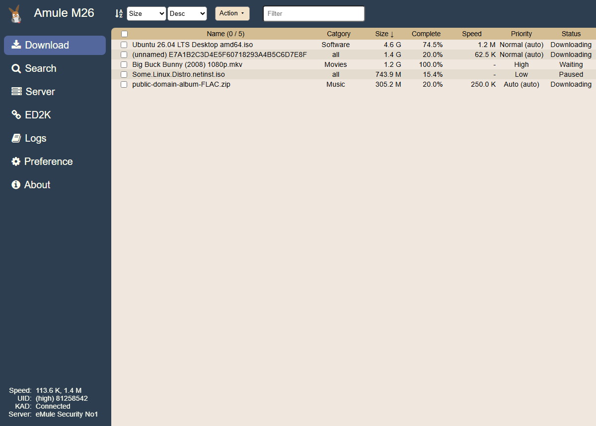

# Template: m26

**Origin:** migrated from
[jjling2011/amule-m26](https://github.com/jjling2011/amule-m26) (GPL-2.0)
— "A morden aMule WebUI template": a Vue 3 + Vite single-page app with a
fixed sidebar, light/dark themes, Font Awesome icons and a filter
mini-language. The upstream runs against its **own patched aMule**
(`docker/tmp/m26.patch`); this directory ports the design and everything
api.php can serve to **stock amuleweb**, as a Preact SPA like the rest of
this repository. Licensed **GPL-2.0-or-later**.

Look and behavior transcribed from the upstream sources: the
`#2c3e50` sidebar with the m26 mule icon and live Speed / UID / KAD /
Server stats, fixed toolbar + table header, striped rows, the tan light
theme and navy dark theme (same `m26-color-theme-name` storage key, so
the login page follows along), and the **filter mini-language**
(`text`, `-text`, `^starts`, `#category`, `@` selected, `>10` / `<200`
MiB, `>20%` / `<80%` completion — see the About view).

## Features

* Download: sort selects + Action menu (pause / resume / remove /
  priority up & down / **copy ed2k links** — the `transfers` API route
  now exposes each file's link), select-all, live filter box.
* Search (local / global / KAD): results mark files that are already in
  the download queue, queue into any category, same filter box.
* Server: connect/remove per row with the connected server highlighted
  as *Active*, Connect menu (disconnect server, connect / disconnect
  KAD), **Bootstrap KAD** from `IPv4:port` or a nodes.dat URL, add
  server as `IPv4:port name`.
* ED2K: paste-many-links view with live link counter and category.
* Logs: amule / server / stats categories (stats renders the statistics
  tree as text, like the upstream), clear, auto-scroll.
* Preference: grouped key/value table (general / connection / files /
  webserver) with the upstream's descriptions, theme switcher, save,
  log out.
* About: the upstream's filter help. Guest-mode awareness, serialized
  request queue (amuleweb is single-threaded), PWA manifest.

## Not implemented (needs the upstream's patched backend)

Per this repository's policy these stay on stock amuleweb + api.php and
are documented instead of implemented:

* **Move to category** — requires the upstream's `EC_OP_PARTFILE_SET_CAT`
  webserver patch; stock amuleweb's PHP bridge cannot change a
  download's category.
* **Request UTF-8 handling / encoding fixer** — the upstream patches
  amuleweb's request decoding and pairs it with a client-side iconv
  repair pass (`encoding-fixer.js`). On stock amuleweb, non-ASCII safety
  is handled server-side by api.php's escaper instead.
* **Delta polling** (`GetTaskHash` / `GetSearchHash` /
  `GetServerAddressHash`) — upstream `serv.php` hashes its lists (with
  patched-in PHP builtins) so the client only refetches on change; this
  port polls on an interval through the serialized queue.
* **Server-list preferences** (`add_from_server` / `add_from_client`) —
  added to the PHP bridge by the upstream patch.

Also, by upstream design (its README lists them as intentionally
missing): no upload list and no statistics graphs. The upstream's custom
dialog widgets are replaced by native browser dialogs, and the zh/en
language switcher by English-only texts (repository convention).

More screenshots: [dark](../../docs/screenshots/m26/dark.png),
[mobile](../../docs/screenshots/m26/mobile.png).
