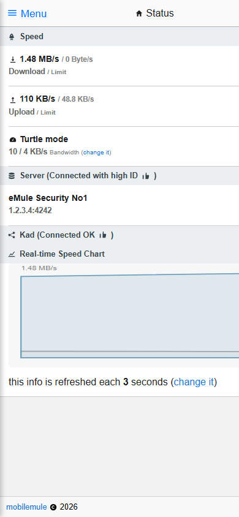

# Template: mobilemule

**Origin:** migrated from
[elbowz/mobileMule](https://github.com/elbowz/mobileMule) by muttley
(GPL-3.0); the PWA icons are the original assets.

A mobile-first (but desktop-friendly) interface, rebuilt as a single-page
app on the shared JSON layer ([`common/api.php`](../../common/api.php)).
The original was built on the now-obsolete **jQuery Mobile**; this port
replaces it with the **Onsen UI CSS components** (Apache-2.0, fetched by
`dev/download-deps.*`), which keep the same list-based mobile feel and —
like jQuery Mobile's old ThemeRoller — are themable with Onsen's official
[Theme Roller](https://onsen.io/theme-roller/): export a theme and replace
`onsen-css-components.min.css`. A dark variant ships alongside and can be
toggled from the *MobileMule* settings page.

Kept from the original (same page hashes, `#page-status`, `#page-downloads`, …):

* Status page with speed/limits, server and Kad state, the **real-time
  speed chart** (now dependency-free SVG instead of Chart.js) and the
  **turtle mode** flip switch (limits configurable, previous limits backed
  up and restored, all persisted in the browser).
* Downloads with per-file and bulk commands, text filter, status/category
  filters and sorting persisted in localStorage, progress bar with the
  done/total text inside and the percent bubble.
* **Finished** page (downloads that disappeared from the queue since you
  last looked — tracked client-side), uploads, shared, servers (tap to
  connect, connected server highlighted), listed statistics with
  drill-down + collapsible variant, server-rendered graphs, log, add-ed2k
  page, per-page refresh intervals, "Remember me" autologin and the PWA
  metadata (manifest + icons).

Changes:

* **Search and aMule Settings are standard** — upstream sold them as a
  "Donation Package" (the public repository does not include them); they
  are implemented here natively in the same style.
* jQuery / jQuery Mobile / Handlebars / underscore / Chart.js / CDNs /
  Google Analytics: all gone. Everything is self-hosted and tracker-free;
  icons are inline SVG (no Font Awesome webfont — amuleweb cannot serve
  font files).
* The remember-me autologin no longer loops forever on a wrong stored
  password. Note that, like the original, it stores the password in a
  browser cookie — use it on trusted devices only.

There is also a [downloads screenshot](../../docs/screenshots/mobilemule/downloads.png)
and a [desktop screenshot](../../docs/screenshots/mobilemule/desktop.png).
