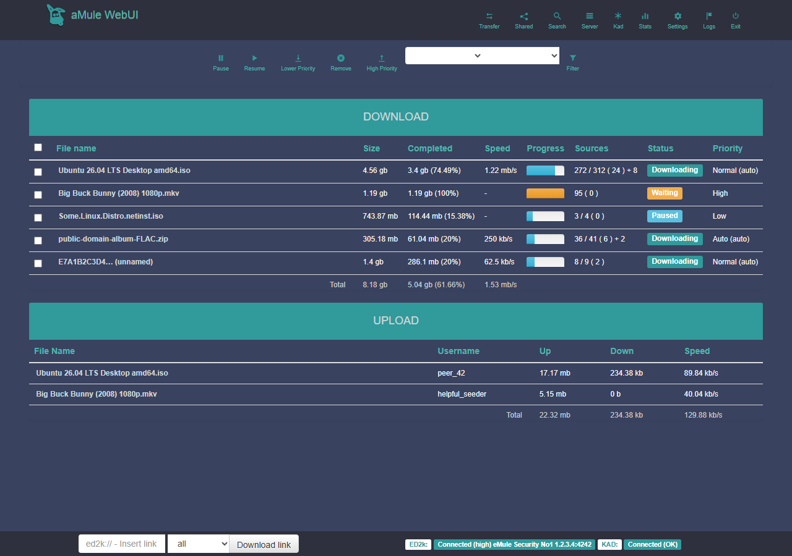

# Template: reloaded

**Origin:** migrated from
[MatteoRagni/AmuleWebUI-Reloaded](https://github.com/MatteoRagni/AmuleWebUI-Reloaded)
(Material theme, GPL-3.0); logos, tree icons and the Bootstrap 3 stylesheets
are the original assets.

The dark "Material" Bootstrap UI of AmuleWebUI-Reloaded, rebuilt as a
single-page app on the shared JSON layer
([`common/api.php`](../../common/api.php)).

Differences from the original (behavior-preserving):

* **Fully self-hosted**: the original loaded jQuery, Bootstrap and
  animate.css from CDNs — this port ships the Bootstrap CSS, implements the
  interactions (popovers, carousel, scroll-to-top, select-all) natively and
  inlines the two animate.css effects, so it works on a LAN with no
  internet access.
* The Glyphicons **webfont is replaced by inline SVG equivalents**:
  amuleweb cannot serve font files, which is exactly why the original
  depended on a CDN.
* No full-page reloads: views poll the API and update in place; the
  ED2k/KAD footer status updates live.
* Modern phone support: the original's navbar simply disappeared on small
  screens (Bootstrap 3 collapse without a toggle); here it scrolls
  horizontally, tables scroll inside their panels and the footer unpins.
* Deep-linkable views: `#download`, `#shared`, `#search`, `#servers`,
  `#kad`, `#stats`, `#prefs`, `#log`; installable as a PWA behind an HTTPS
  proxy (web manifest included).

Everything else follows the original: the tasks panels, the Bootstrap
progress bars with the 4px chunk strip underneath (`dyn_<hash>.png`,
rendered by amuleweb) and the segments popover on hover, the status/label
pills, the statistics carousel with the four server-rendered graphs, the
collapsible statistics tree, and the login page.

There is also a [mobile screenshot](../../docs/screenshots/reloaded/mobile.png).
