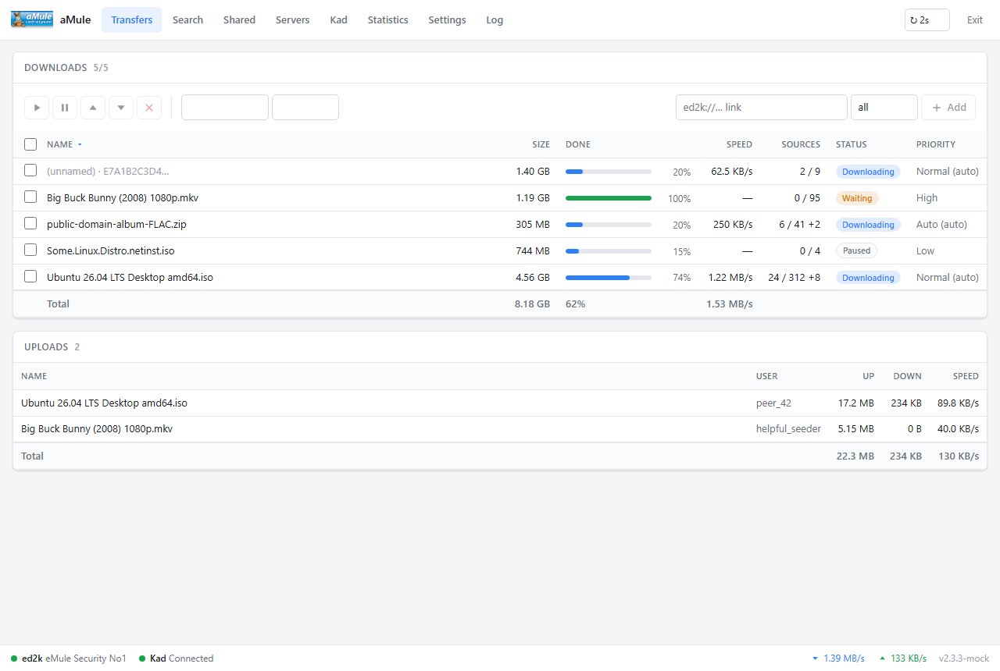

# Template: simple

**Origin:** original design.

A clean, minimalist control panel for amuleweb. Single-page app (Preact +
HTM, no build step) talking to the shared JSON layer
([`common/api.php`](../../common/api.php)).



## Features

* Transfers: chunk-level progress bars, pause / resume / cancel / priority,
  status & category filters, add ed2k links, totals.
* Search (local / global / Kad) with size & availability filters; queue
  results into any category.
* Shared files: reload, priorities, transfer statistics.
* Servers: connect / remove / add, live user & file counts.
* Kad: connect / disconnect / bootstrap, nodes.dat update, nodes graph.
* Statistics: aMule's own speed & connection graphs plus the full
  collapsible statistics tree.
* Settings: bandwidth limits, connection, ports, files, web server.
* Log & server info, with reset.
* No images beyond the aMule logo — icons are inline SVG.
* Light + dark theme (follows the system), responsive down to phones.
* Auto-refresh with a single serialized request queue — amuleweb is
  single-threaded and is never given more than one request at a time.
* Deep-linkable views: `#transfers`, `#search`, `#shared`, `#servers`,
  `#kad`, `#stats`, `#settings`, `#log`.
* Installable as a PWA behind an HTTPS proxy (web manifest included).

More screenshots: [dark mode](../../docs/screenshots/simple/dark.png),
[statistics](../../docs/screenshots/simple/statistics.png),
[mobile](../../docs/screenshots/simple/mobile.png).

## Files

```
index.html                       SPA shell (served after login)
login.php                        Password page (self-contained, inline CSS)
app.js                           The whole UI (ES module)
app.css                          Theme (light + dark)
logo.png, favicon.ico            The only bundled images
```

The deployable form of this template also contains `api.php` (copied from
`common/`) and `preact-htm-standalone.module.js` (fetched by
`dev/download-deps.*`); `scripts/build.*` assembles it under `dist/simple`.

## Notes

* Names that the interpreter cannot escape are emitted raw, and rows with an
  empty name fall back to `(unnamed) · <hash>` — see the comments in
  `common/api.php` for the gory details of amuleweb's PHP dialect.
* Guest logins disable every command; the UI reflects it.
