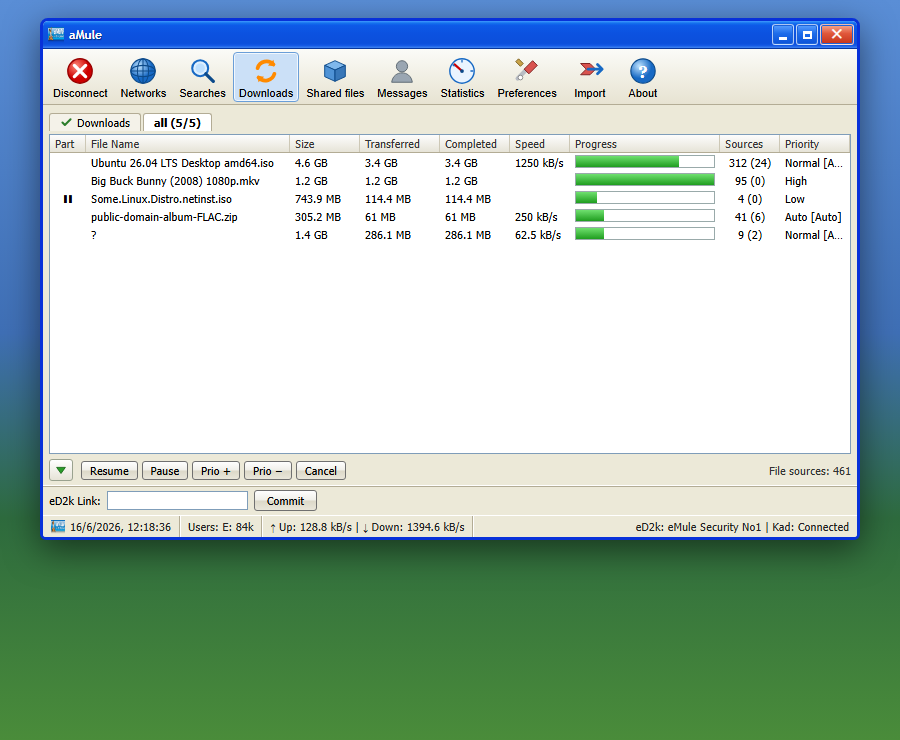

# Template: xpdesktop

**Origin:** original design — a recreation of the **aMule desktop client as
it looks running on Windows XP** (the "Luna" theme), rebuilt in the browser
on top of the shared [`api.php`](../../common/api.php) JSON layer. The aMule
GUI belongs to the [aMule project](https://www.amule.org); this skin imitates
its look, it is not a migration of an existing web template.

The blue Luna title bar with its caption buttons, the Tahoma typography, the
aMule toolbar with its icon set, the listview columns, XP buttons / tabs /
group-boxes / scrollbars and the Luna selection highlight — all recreated in
CSS, with the window floating on an XP desktop.

## Views

The toolbar mirrors the desktop client and each entry drives the matching
`api.php` data:

* **Downloads** — the transfer list (Part / File Name / Size / Transferred /
  Completed / Speed / Progress / Sources / Priority) with the chunk-progress
  bars, the bottom action bar (Resume / Pause / Prio ± / Cancel) and the
  category tab.
* **Networks → ED2K** — the server list with connect (double-click) / remove
  (right-click) / add-manually / disconnect.
* **Networks → Kad** — the nodes graph, bootstrap from a node (IP:port),
  bootstrap from known clients, disconnect, nodes.dat-from-URL update.
* **Searches** — local / global / Kad search and download of a result.
* **Shared files** — the shared list with reload.
* **Statistics** — the Download-Speed / Upload-Speed / Connections graphs
  (server-rendered PNGs) and the collapsible Statistics Tree.
* **Preferences** — the desktop client's modal dialog, with the category
  list and the pages the web API can change (General, Connection, Files).
* **Disconnect / Import / About** — toolbar actions and the About box.

The eD2k-link bar and the status bar (live clock, users, up/down speed,
eD2k / Kad state) sit at the bottom, as on the desktop.

## Options the web API can't reach (shown disabled)

To stay faithful to the desktop client while being honest about the web
backend, controls that `api.php` does not expose are rendered **present but
disabled** (greyed), not hidden:

* the Search **Extended Parameters** / **Filtering** checkboxes and the
  **More** / **Stop** buttons;
* the ED2K **server.met-from-URL** update field;
* the Shared files **"Show Clients for"** radios (no per-file client list);
* the **Messages / Friends** view (no message bridge in `api.php`) — shown
  for fidelity, fully inert;
* the Preferences pages that the web interface cannot modify (Directories,
  Servers, Security, Interface, Statistics, Proxy, Filters, Remote Controls,
  Online Signature, Advanced, Events) — their options are listed but
  disabled.

On a phone the window fills the screen and the toolbar collapses to icons.

More screenshots: [networks](../../docs/screenshots/xpdesktop/networks.png),
[statistics](../../docs/screenshots/xpdesktop/statistics.png).
